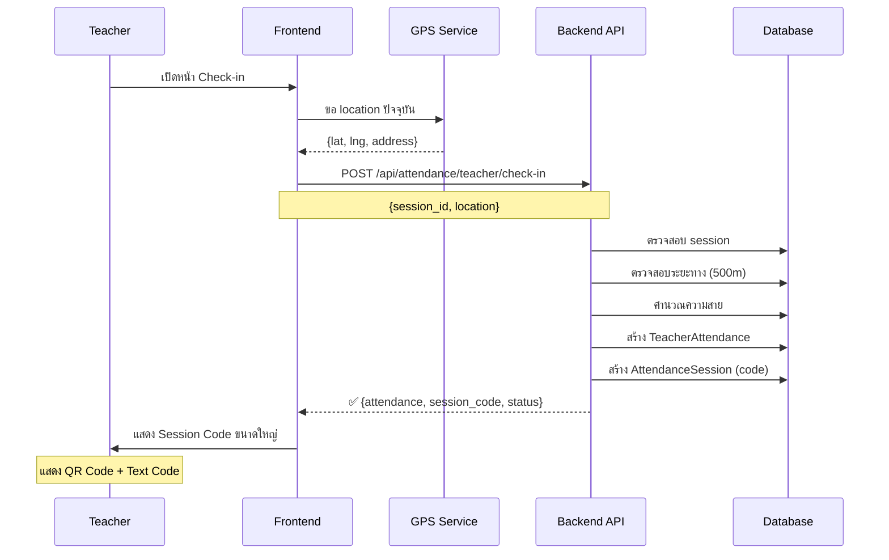
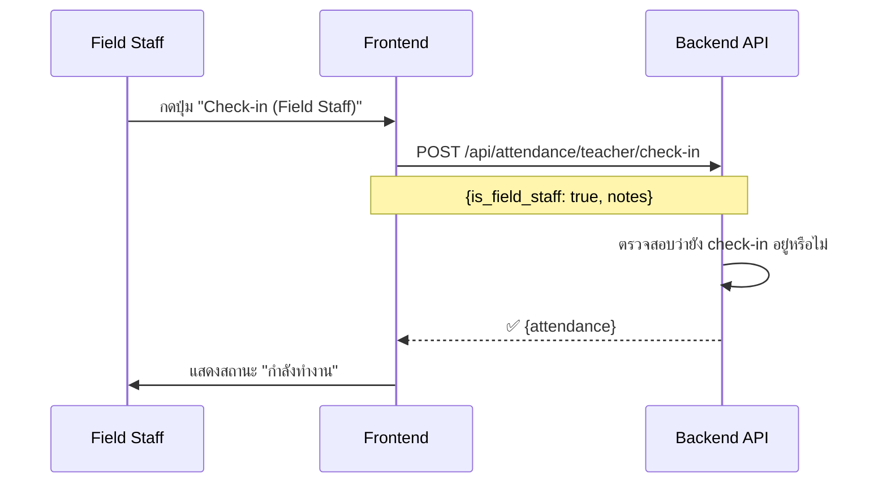
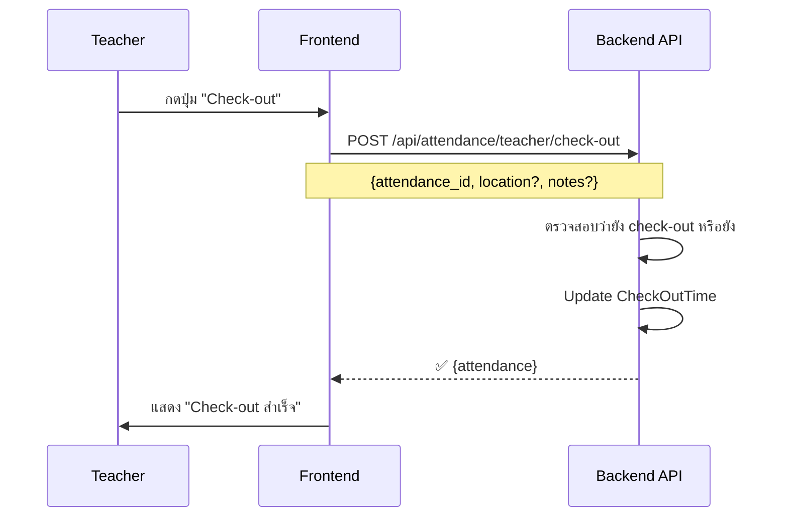
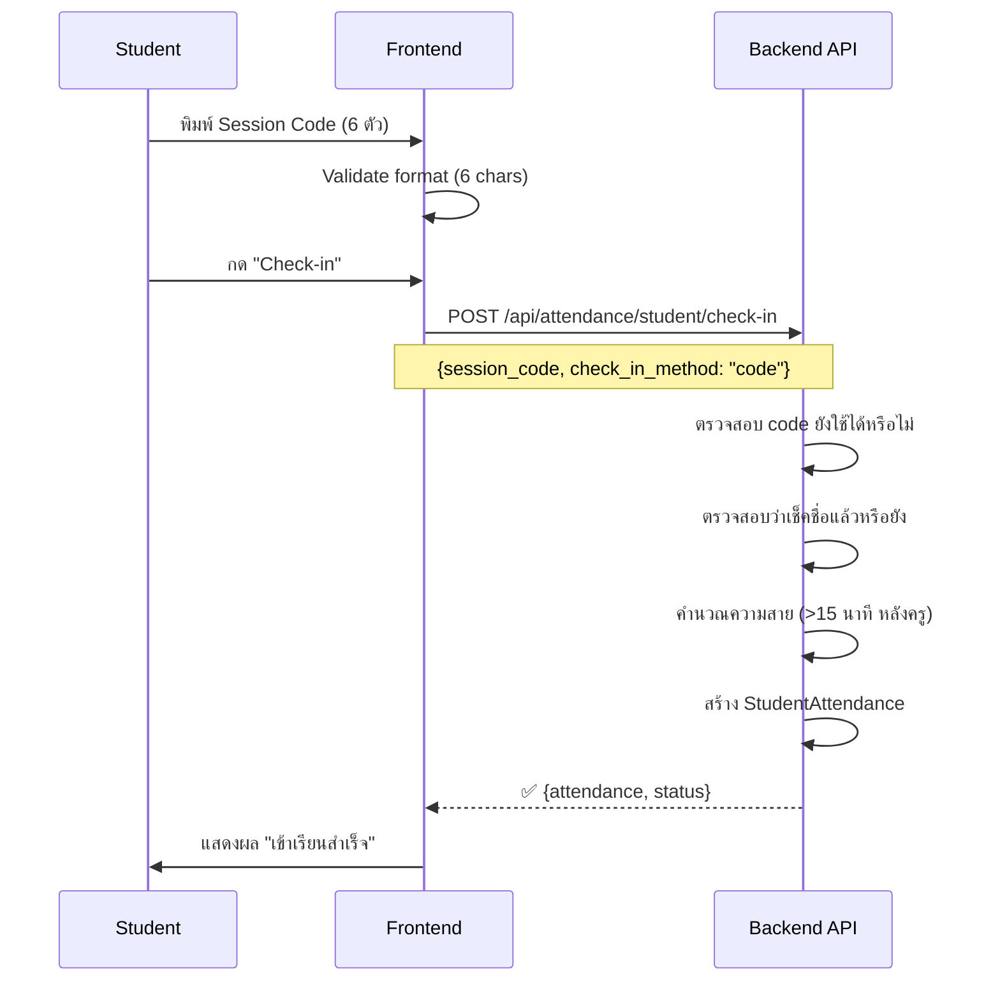

# Attendance System - Frontend Developer Guide

คู่มือการทำระบบ Check-in/Check-out สำหรับ Frontend Developers

---

## 📋 Table of Contents

1. [Overview](#overview)
2. [User Roles & Permissions](#user-roles--permissions)
3. [Teacher Flow](#teacher-flow)
4. [Student Flow](#student-flow)
5. [Admin Flow](#admin-flow)
6. [API Endpoints Summary](#api-endpoints-summary)
7. [UI Components Guide](#ui-components-guide)
8. [Error Handling](#error-handling)
9. [Best Practices](#best-practices)

---

## Overview

### System Capabilities
- ✅ **Teacher Check-in/out**: GPS-based location validation (500m radius)
- ✅ **Student Check-in**: Session code (6 characters) or QR code
- ✅ **Field Staff**: Check-in without location/session requirements
- ✅ **Auto Check-out**: Automatic when session ends
- ✅ **Late Detection**: Automatic calculation
- ✅ **Reports**: Daily, weekly, monthly, yearly, individual

### Key Concepts
- **Session Code**: 6-character code (e.g., `A5K9P2`) generated when teacher checks in
- **Late Threshold**: 
  - Teacher: >15 minutes after scheduled start
  - Student: >15 minutes after teacher check-in
- **Location Radius**: 500 meters from branch location
- **Auto Check-out**: Runs every 5 minutes

---

## User Roles & Permissions

| Feature | Student | Teacher | Admin | Owner |
|---------|---------|---------|-------|-------|
| Check-in (Student) | ✅ | ❌ | ❌ | ❌ |
| Check-in (Teacher) | ❌ | ✅ | ❌ | ❌ |
| Generate Session Code | ❌ | ✅ | ✅ | ✅ |
| View Student List | ❌ | ✅ | ✅ | ✅ |
| View Reports | ❌ | ❌ | ✅ | ✅ |
| View History (Self) | ✅ | ✅ | ✅ | ✅ |

---

## Teacher Flow

### Flow 1: Regular Teacher Check-in (มีคาบสอน)



#### Step 1: เปิดหน้า Check-in

**UI ที่ต้องมี:**
- Dropdown เลือก Session (วันนี้)
- ปุ่ม "Check-in" (disable จนกว่าจะได้ GPS)
- แสดงสถานะ GPS: "กำลังหาตำแหน่ง..." / "พบตำแหน่งแล้ว ✓"

**Request Permissions:**
```javascript
const getLocation = async () => {
  try {
    const position = await new Promise((resolve, reject) => {
      navigator.geolocation.getCurrentPosition(resolve, reject, {
        enableHighAccuracy: true,
        timeout: 10000,
        maximumAge: 0
      });
    });

    return {
      latitude: position.coords.latitude,
      longitude: position.coords.longitude,
      accuracy: position.coords.accuracy
    };
  } catch (error) {
    throw new Error('ไม่สามารถเข้าถึง GPS ได้ กรุณาเปิด Location Services');
  }
};
```

#### Step 2: เลือก Session

**API Call:**
```javascript
// ดึง Sessions ของวันนี้
const getTodaySessions = async () => {
  const response = await fetch('/api/schedules/my', {
    headers: {
      'Authorization': `Bearer ${token}`
    }
  });

  const data = await response.json();
  
  // Filter sessions ที่เป็นวันนี้ และยังไม่ cancelled
  const today = new Date().toISOString().split('T')[0];
  return data.schedules
    .flatMap(schedule => schedule.sessions)
    .filter(session => 
      session.session_date.startsWith(today) && 
      session.status !== 'cancelled'
    );
};
```

**UI:**
```jsx
<select value={selectedSession} onChange={(e) => setSelectedSession(e.target.value)}>
  <option value="">-- เลือกคาบเรียน --</option>
  {sessions.map(session => (
    <option key={session.id} value={session.id}>
      {session.schedule_name} - {formatTime(session.start_time)} - {session.room_name}
    </option>
  ))}
</select>
```

#### Step 3: Check-in

**API Call:**
```javascript
const teacherCheckIn = async (sessionId, location) => {
  const response = await fetch('/api/attendance/teacher/check-in', {
    method: 'POST',
    headers: {
      'Authorization': `Bearer ${token}`,
      'Content-Type': 'application/json'
    },
    body: JSON.stringify({
      session_id: parseInt(sessionId),
      location: {
        latitude: location.latitude,
        longitude: location.longitude,
        address: location.address || 'Unknown'
      },
      notes: '' // Optional
    })
  });

  if (!response.ok) {
    const error = await response.json();
    throw new Error(error.error || 'Check-in failed');
  }

  return await response.json();
};
```

**Response:**
```json
{
  "success": true,
  "message": "Check-in successful",
  "attendance": {
    "id": 123,
    "teacher_id": 5,
    "session_id": 789,
    "check_in_time": "2025-10-25T14:03:00+07:00",
    "status": "late",
    "late_minutes": 3,
    "location_verified": true,
    "distance_meters": 245.5
  },
  "session_code": "A5K9P2",
  "status_info": {
    "status": "late",
    "late_minutes": 3
  }
}
```

#### Step 4: แสดง Session Code

**UI Design:**
```jsx
const SessionCodeDisplay = ({ code, sessionId }) => {
  const qrCodeUrl = `https://api.qrserver.com/v1/create-qr-code/?size=300x300&data=${code}`;

  return (
    <div className="session-code-container">
      <h2>✅ Check-in สำเร็จ</h2>
      
      {/* QR Code */}
      <div className="qr-code">
        
        <p className="text-center mt-2">สแกน QR หรือพิมพ์โค้ด</p>
      </div>

      {/* Text Code */}
      <div className="text-code">
        <h1 className="code-display">{code}</h1>
        <button onClick={() => copyToClipboard(code)}>
          📋 Copy Code
        </button>
      </div>

      {/* Timer */}
      <SessionTimer expiresAt={sessionEndTime} />

      {/* Actions */}
      <div className="actions">
        <button onClick={() => refreshCode(sessionId)}>
          🔄 สร้างโค้ดใหม่
        </button>
        <button onClick={() => viewStudentList(sessionId)}>
          👥 ดูรายชื่อนักเรียน
        </button>
      </div>
    </div>
  );
};
```

---

### Flow 2: Field Staff Check-in (ไม่มีคาบสอน)



**API Call:**
```javascript
const fieldStaffCheckIn = async (notes) => {
  const response = await fetch('/api/attendance/teacher/check-in', {
    method: 'POST',
    headers: {
      'Authorization': `Bearer ${token}`,
      'Content-Type': 'application/json'
    },
    body: JSON.stringify({
      is_field_staff: true,
      notes: notes || 'Field work'
    })
  });

  return await response.json();
};
```

**UI:**
```jsx
<div className="field-staff-checkin">
  <h3>🚗 Field Staff Check-in</h3>
  <p>ไม่ต้องระบุตำแหน่ง / ไม่ต้องมีคาบสอน</p>
  
  <textarea
    placeholder="หมายเหตุ (เช่น: เยี่ยมลูกค้า 3 ราย)"
    value={notes}
    onChange={(e) => setNotes(e.target.value)}
  />
  
  <button onClick={handleFieldStaffCheckIn}>
    Check-in
  </button>
</div>
```

---

### Flow 3: Teacher Check-out



**API Call:**
```javascript
const teacherCheckOut = async (attendanceId, location, notes) => {
  const response = await fetch('/api/attendance/teacher/check-out', {
    method: 'POST',
    headers: {
      'Authorization': `Bearer ${token}`,
      'Content-Type': 'application/json'
    },
    body: JSON.stringify({
      attendance_id: attendanceId,
      location: location, // Optional
      notes: notes // Optional
    })
  });

  return await response.json();
};
```

**UI:**
```jsx
const CheckOutButton = ({ attendance }) => {
  const [notes, setNotes] = useState('');

  const handleCheckOut = async () => {
    if (!confirm('ยืนยันการ Check-out?')) return;

    try {
      await teacherCheckOut(attendance.id, null, notes);
      alert('✅ Check-out สำเร็จ');
      // Redirect หรือ refresh
    } catch (error) {
      alert(`❌ ${error.message}`);
    }
  };

  return (
    <div className="checkout-section">
      <input
        type="text"
        placeholder="หมายเหตุ (optional)"
        value={notes}
        onChange={(e) => setNotes(e.target.value)}
      />
      <button onClick={handleCheckOut} className="btn-danger">
        Check-out
      </button>
      <p className="text-muted">
        ⚠️ หมายเหตุ: ระบบจะ auto check-out เมื่อสิ้นสุดคาบเรียน
      </p>
    </div>
  );
};
```

---

### Flow 4: View Today's Status

**API Call:**
```javascript
const getTodayStatus = async () => {
  const response = await fetch('/api/attendance/teacher/status', {
    headers: {
      'Authorization': `Bearer ${token}`
    }
  });

  return await response.json();
};
```

**Response:**
```json
{
  "success": true,
  "date": "2025-10-25T00:00:00Z",
  "count": 2,
  "attendances": [
    {
      "id": 123,
      "session_id": 789,
      "check_in_time": "2025-10-25T09:00:00+07:00",
      "check_out_time": "2025-10-25T11:00:00+07:00",
      "status": "on-time",
      "session": {
        "schedule_name": "English A1",
        "start_time": "09:00",
        "end_time": "11:00"
      }
    },
    {
      "id": 124,
      "session_id": 790,
      "check_in_time": "2025-10-25T14:03:00+07:00",
      "check_out_time": null,
      "status": "late",
      "late_minutes": 3,
      "session": {
        "schedule_name": "English A2",
        "start_time": "14:00",
        "end_time": "16:00"
      }
    }
  ]
}
```

**UI:**
```jsx
const TodayAttendanceStatus = () => {
  const [attendances, setAttendances] = useState([]);

  useEffect(() => {
    loadTodayStatus();
  }, []);

  return (
    <div className="today-status">
      <h3>📊 สถานะวันนี้</h3>
      
      {attendances.map(att => (
        <div key={att.id} className="attendance-card">
          <div className="status-badge" data-status={att.status}>
            {att.status === 'on-time' && '✅ ตรงเวลา'}
            {att.status === 'late' && `⏰ สาย ${att.late_minutes} นาที`}
            {att.status === 'field-work' && '🚗 Field Work'}
          </div>

          <h4>{att.session?.schedule_name || 'Field Work'}</h4>
          <p>Check-in: {formatTime(att.check_in_time)}</p>
          
          {att.check_out_time ? (
            <p>Check-out: {formatTime(att.check_out_time)} ✓</p>
          ) : (
            <button onClick={() => checkOut(att.id)}>
              Check-out ตอนนี้
            </button>
          )}
        </div>
      ))}
    </div>
  );
};
```

---

## Student Flow

### Flow 1: Student Check-in (กรอกโค้ด)



**UI Component:**
```jsx
const StudentCheckIn = () => {
  const [code, setCode] = useState('');
  const [loading, setLoading] = useState(false);

  const handleSubmit = async (e) => {
    e.preventDefault();

    // Validate format
    if (code.length !== 6) {
      alert('โค้ดต้องมี 6 ตัวอักษร');
      return;
    }

    setLoading(true);

    try {
      const result = await studentCheckIn(code, 'code');
      
      // แสดงผลสำเร็จ
      showSuccessModal({
        status: result.status_info.status,
        lateMinutes: result.status_info.late_minutes,
        session: result.attendance.session
      });

    } catch (error) {
      alert(`❌ ${error.message}`);
    } finally {
      setLoading(false);
    }
  };

  return (
    <div className="student-checkin">
      <h2>✏️ เช็คชื่อเข้าเรียน</h2>
      
      <form onSubmit={handleSubmit}>
        <input
          type="text"
          placeholder="กรอกโค้ด 6 ตัวอักษร (เช่น A5K9P2)"
          value={code}
          onChange={(e) => setCode(e.target.value.toUpperCase())}
          maxLength={6}
          autoFocus
          required
        />

        <button type="submit" disabled={loading || code.length !== 6}>
          {loading ? 'กำลังตรวจสอบ...' : 'เช็คชื่อ'}
        </button>
      </form>

      <div className="or-divider">หรือ</div>

      <button onClick={() => openQRScanner()}>
        📷 สแกน QR Code
      </button>
    </div>
  );
};
```

**API Call:**
```javascript
const studentCheckIn = async (sessionCode, method = 'code') => {
  const response = await fetch('/api/attendance/student/check-in', {
    method: 'POST',
    headers: {
      'Authorization': `Bearer ${token}`,
      'Content-Type': 'application/json'
    },
    body: JSON.stringify({
      session_code: sessionCode,
      check_in_method: method // "code" or "qr"
    })
  });

  if (!response.ok) {
    const error = await response.json();
    throw new Error(error.error || 'Check-in failed');
  }

  return await response.json();
};
```

**Response:**
```json
{
  "success": true,
  "message": "Check-in successful",
  "attendance": {
    "id": 456,
    "student_id": 789,
    "session_id": 123,
    "check_in_time": "2025-10-25T14:18:00+07:00",
    "status": "late",
    "late_minutes": 3,
    "check_in_method": "code"
  },
  "status_info": {
    "status": "late",
    "late_minutes": 3
  }
}
```

---

### Flow 2: Student Check-in (สแกน QR)

**QR Scanner Component:**
```jsx
import { Html5QrcodeScanner } from 'html5-qrcode';

const QRScanner = ({ onScanSuccess, onClose }) => {
  const scannerRef = useRef(null);

  useEffect(() => {
    const scanner = new Html5QrcodeScanner(
      "qr-reader",
      { 
        fps: 10,
        qrbox: { width: 250, height: 250 }
      },
      false
    );

    scanner.render(
      (decodedText) => {
        // decodedText = "A5K9P2"
        scanner.clear();
        onScanSuccess(decodedText);
      },
      (error) => {
        console.warn('QR Scan error:', error);
      }
    );

    scannerRef.current = scanner;

    return () => {
      scanner.clear();
    };
  }, []);

  return (
    <div className="qr-scanner-modal">
      <div className="modal-header">
        <h3>📷 สแกน QR Code</h3>
        <button onClick={onClose}>✖</button>
      </div>
      <div id="qr-reader"></div>
    </div>
  );
};
```

---

### Flow 3: View My History

**API Call:**
```javascript
const getMyHistory = async (startDate, endDate, limit = 30, offset = 0) => {
  const params = new URLSearchParams({
    start_date: startDate,
    end_date: endDate,
    limit,
    offset
  });

  const response = await fetch(`/api/attendance/student/history?${params}`, {
    headers: {
      'Authorization': `Bearer ${token}`
    }
  });

  return await response.json();
};
```

**Response:**
```json
{
  "success": true,
  "total": 45,
  "limit": 30,
  "offset": 0,
  "attendances": [
    {
      "id": 456,
      "session_id": 123,
      "attendance_date": "2025-10-25T00:00:00Z",
      "check_in_time": "2025-10-25T14:18:00+07:00",
      "status": "late",
      "late_minutes": 3,
      "session": {
        "schedule_name": "English A1",
        "session_number": 15
      }
    }
  ]
}
```

**UI:**
```jsx
const MyAttendanceHistory = () => {
  const [attendances, setAttendances] = useState([]);
  const [stats, setStats] = useState({ present: 0, late: 0, absent: 0 });

  return (
    <div className="history-container">
      <div className="stats-grid">
        <div className="stat-card present">
          <h3>{stats.present}</h3>
          <p>มาตรงเวลา</p>
        </div>
        <div className="stat-card late">
          <h3>{stats.late}</h3>
          <p>มาสาย</p>
        </div>
        <div className="stat-card absent">
          <h3>{stats.absent}</h3>
          <p>ขาดเรียน</p>
        </div>
      </div>

      <div className="history-list">
        {attendances.map(att => (
          <div key={att.id} className={`history-item ${att.status}`}>
            <div className="date">
              {formatDate(att.attendance_date)}
            </div>
            <div className="details">
              <h4>{att.session.schedule_name}</h4>
              <p>Session #{att.session.session_number}</p>
              <span className={`badge ${att.status}`}>
                {att.status === 'present' && '✅ ตรงเวลา'}
                {att.status === 'late' && `⏰ สาย ${att.late_minutes} นาที`}
              </span>
            </div>
          </div>
        ))}
      </div>
    </div>
  );
};
```

---

## Admin Flow

### Flow 1: View Student List (ครูหรือ Admin)

**API Call:**
```javascript
const getStudentList = async (sessionId) => {
  const response = await fetch(`/api/attendance/sessions/${sessionId}/students`, {
    headers: {
      'Authorization': `Bearer ${token}`
    }
  });

  return await response.json();
};
```

**Response:**
```json
{
  "success": true,
  "session": {
    "id": 123,
    "schedule_name": "English A1",
    "session_number": 15,
    "start_time": "2025-10-25T14:00:00+07:00"
  },
  "total_enrolled": 20,
  "checked_in": 18,
  "on_time": 15,
  "late": 3,
  "absent": 2,
  "students": [
    {
      "student_id": 789,
      "student_name": "John Doe",
      "username": "john_doe",
      "checked_in": true,
      "check_in_time": "2025-10-25T14:05:00+07:00",
      "status": "present",
      "late_minutes": 0
    },
    {
      "student_id": 790,
      "student_name": "Jane Smith",
      "username": "jane_smith",
      "checked_in": false,
      "status": "absent"
    }
  ]
}
```

**UI:**
```jsx
const StudentListView = ({ sessionId }) => {
  const [data, setData] = useState(null);

  return (
    <div className="student-list">
      <div className="header">
        <h3>{data?.session.schedule_name}</h3>
        <p>Session #{data?.session.session_number}</p>
      </div>

      <div className="stats">
        <span>✅ เข้าเรียน: {data?.checked_in}/{data?.total_enrolled}</span>
        <span>⏰ สาย: {data?.late}</span>
        <span>❌ ขาด: {data?.absent}</span>
      </div>

      <table>
        <thead>
          <tr>
            <th>ลำดับ</th>
            <th>ชื่อ</th>
            <th>สถานะ</th>
            <th>เวลา</th>
          </tr>
        </thead>
        <tbody>
          {data?.students.map((student, index) => (
            <tr key={student.student_id} className={student.status}>
              <td>{index + 1}</td>
              <td>{student.student_name}</td>
              <td>
                {student.checked_in ? (
                  <span className={`badge ${student.status}`}>
                    {student.status === 'present' ? '✅ มา' : `⏰ สาย ${student.late_minutes} นาที`}
                  </span>
                ) : (
                  <span className="badge absent">❌ ขาด</span>
                )}
              </td>
              <td>
                {student.check_in_time ? formatTime(student.check_in_time) : '-'}
              </td>
            </tr>
          ))}
        </tbody>
      </table>
    </div>
  );
};
```

---

### Flow 2: Reports (Admin Only)

#### Daily Report

**API Call:**
```javascript
const getDailyReport = async (date, branchId = null) => {
  const params = new URLSearchParams({ date });
  if (branchId) params.append('branch_id', branchId);

  const response = await fetch(`/api/attendance/reports/daily?${params}`, {
    headers: {
      'Authorization': `Bearer ${adminToken}`
    }
  });

  return await response.json();
};
```

**Response:**
```json
{
  "success": true,
  "date": "2025-10-25",
  "teacher_summary": {
    "total": 10,
    "on_time": 7,
    "late": 2,
    "field_work": 1
  },
  "student_summary": {
    "total": 150,
    "present": 140,
    "late": 8,
    "absent": 2
  },
  "teacher_attendances": [...],
  "student_attendances": [...]
}
```

#### Weekly Report

```javascript
const getWeeklyReport = async (startDate, endDate, branchId = null) => {
  const params = new URLSearchParams({ start_date: startDate, end_date: endDate });
  if (branchId) params.append('branch_id', branchId);

  const response = await fetch(`/api/attendance/reports/weekly?${params}`, {
    headers: {
      'Authorization': `Bearer ${adminToken}`
    }
  });

  return await response.json();
};
```

#### Monthly Report

```javascript
const getMonthlyReport = async (year, month, branchId = null) => {
  const params = new URLSearchParams({ year, month });
  if (branchId) params.append('branch_id', branchId);

  const response = await fetch(`/api/attendance/reports/monthly?${params}`, {
    headers: {
      'Authorization': `Bearer ${adminToken}`
    }
  });

  return await response.json();
};
```

#### Individual Report

```javascript
const getIndividualReport = async (userId, startDate, endDate) => {
  const params = new URLSearchParams({ 
    user_id: userId,
    start_date: startDate,
    end_date: endDate
  });

  const response = await fetch(`/api/attendance/reports/individual?${params}`, {
    headers: {
      'Authorization': `Bearer ${adminToken}`
    }
  });

  return await response.json();
};
```

---

## API Endpoints Summary

### Teacher Endpoints

| Method | Endpoint | Description | Auth |
|--------|----------|-------------|------|
| POST | `/api/attendance/teacher/check-in` | Check-in (session or field) | Teacher |
| POST | `/api/attendance/teacher/check-out` | Check-out | Teacher |
| GET | `/api/attendance/teacher/status` | Today's status | Teacher |
| GET | `/api/attendance/teacher/history` | Attendance history | Teacher |
| POST | `/api/attendance/sessions/generate-code` | Generate new session code | Teacher |
| GET | `/api/attendance/sessions/:id/code` | Get session code | Teacher |

### Student Endpoints

| Method | Endpoint | Description | Auth |
|--------|----------|-------------|------|
| POST | `/api/attendance/student/check-in` | Check-in with code/QR | Student |
| GET | `/api/attendance/student/history` | My attendance history | Student |

### Admin Endpoints

| Method | Endpoint | Description | Auth |
|--------|----------|-------------|------|
| GET | `/api/attendance/sessions/:id/students` | Student list for session | Teacher/Admin |
| GET | `/api/attendance/reports/daily` | Daily report | Admin |
| GET | `/api/attendance/reports/weekly` | Weekly report | Admin |
| GET | `/api/attendance/reports/monthly` | Monthly report | Admin |
| GET | `/api/attendance/reports/yearly` | Yearly report | Admin |
| GET | `/api/attendance/reports/individual` | Individual report | Admin |

---

## UI Components Guide

### 1. Session Code Display (ครู)

**Design Requirements:**
- แสดง QR Code ขนาดใหญ่ (300x300px)
- แสดงโค้ดตัวอักษรขนาดใหญ่ (font-size: 48px)
- ปุ่ม Copy to Clipboard
- แสดง Timer นับถอยหลังจนหมดอายุ
- ปุ่ม Refresh Code (สร้างโค้ดใหม่)
- Link ไปดูรายชื่อนักเรียน

**Example CSS:**
```css
.session-code-container {
  text-align: center;
  padding: 2rem;
  background: #fff;
  border-radius: 12px;
  box-shadow: 0 2px 8px rgba(0,0,0,0.1);
}

.qr-code img {
  width: 300px;
  height: 300px;
  border: 2px solid #ddd;
  border-radius: 8px;
}

.text-code h1 {
  font-size: 48px;
  font-weight: bold;
  letter-spacing: 8px;
  margin: 1rem 0;
  font-family: 'Courier New', monospace;
  color: #2563eb;
}
```

---

### 2. Student Check-in Form

**Design Requirements:**
- Input field สำหรับพิมพ์โค้ด (6 ตัว, auto uppercase)
- ปุ่ม Check-in (disable จนกว่าจะครบ 6 ตัว)
- ปุ่ม "สแกน QR Code"
- แสดง loading state
- แสดงผลสำเร็จ/ล้มเหลว

---

### 3. Attendance Status Badge

**Status Colors:**
```css
.badge.on-time,
.badge.present {
  background: #10b981;
  color: white;
}

.badge.late {
  background: #f59e0b;
  color: white;
}

.badge.absent {
  background: #ef4444;
  color: white;
}

.badge.field-work {
  background: #3b82f6;
  color: white;
}
```

---

### 4. Student List Table

**Features:**
- Sortable columns
- Filter by status (present/late/absent)
- Search by name
- Export to Excel/PDF
- Real-time updates (WebSocket)

---

## Error Handling

### Common Errors

| Error | Meaning | Action |
|-------|---------|--------|
| `Session not found` | Session ID ไม่ถูกต้อง | ตรวจสอบ session ID |
| `Session is cancelled` | คาบเรียนถูกยกเลิก | แสดงแจ้งเตือน |
| `Already checked in` | เช็คชื่อแล้ว | แสดงข้อมูลเดิม |
| `Location verification failed` | GPS ไม่อยู่ในรัศมี | ขอให้ครูเข้าใกล้สถานที่มากขึ่น |
| `Distance too far (XXXm)` | ระยะทางเกิน 500m | แสดงระยะทางและแผนที่ |
| `Session code expired` | โค้ดหมดอายุ | ขอให้นักเรียนถามครูขอโค้ดใหม่ |
| `Session code not found` | โค้ดไม่ถูกต้อง | ตรวจสอบการพิมพ์ |
| `Attendance not found` | ไม่พบ attendance record | ตรวจสอบ ID |
| `Already checked out` | Check-out แล้ว | แจ้งเตือน |

### Error Handling Pattern

```javascript
try {
  const result = await apiCall();
  // Success
} catch (error) {
  if (error.message.includes('Location verification failed')) {
    showLocationErrorModal(error.distance_meters);
  } else if (error.message.includes('Already checked in')) {
    showAlreadyCheckedInModal(error.attendance);
  } else if (error.message.includes('Session code')) {
    showCodeErrorModal(error.message);
  } else {
    showGenericErrorModal(error.message);
  }
}
```

---

## Best Practices

### 1. GPS Location

**Do:**
- ✅ Request permission early
- ✅ Show loading indicator while getting location
- ✅ Cache location for 30 seconds (don't request every click)
- ✅ Show accuracy indicator
- ✅ Provide fallback (manual address input)

**Don't:**
- ❌ Block UI while waiting for GPS
- ❌ Request GPS permission on page load
- ❌ Use cached location older than 1 minute

### 2. Session Code Display

**Do:**
- ✅ Make code readable (large font, spacing)
- ✅ Include both QR and text code
- ✅ Show expiration timer
- ✅ Auto-refresh every 30 seconds (check if still valid)
- ✅ Provide "Generate New Code" button

**Don't:**
- ❌ Hide code behind modal (should be always visible)
- ❌ Use small fonts
- ❌ Forget to handle expired codes

### 3. Student Check-in

**Do:**
- ✅ Validate input format before submit
- ✅ Convert to uppercase automatically
- ✅ Show clear error messages
- ✅ Provide QR scanner alternative
- ✅ Show confirmation after success

**Don't:**
- ❌ Allow multiple check-ins
- ❌ Submit without validation
- ❌ Keep QR scanner open after success

### 4. Performance

**Do:**
- ✅ Use pagination for history (30 items per page)
- ✅ Cache session list (refresh every 5 minutes)
- ✅ Debounce search inputs (300ms)
- ✅ Use WebSocket for real-time updates

**Don't:**
- ❌ Load all history at once
- ❌ Make API calls on every keystroke
- ❌ Poll API repeatedly (use WebSocket instead)

### 5. UX

**Do:**
- ✅ Show loading states
- ✅ Provide clear feedback
- ✅ Use optimistic updates
- ✅ Allow offline check-in (sync later)
- ✅ Remember last used session

**Don't:**
- ❌ Show technical error messages to users
- ❌ Require multiple steps for simple actions
- ❌ Lose user data on error

---

## Testing Checklist

### Teacher Check-in
- [ ] ✅ Check-in on time (status = "on-time")
- [ ] ✅ Check-in late >15 min (status = "late")
- [ ] ✅ Check-in with GPS in range (<500m)
- [ ] ❌ Check-in with GPS out of range (>500m) - should fail
- [ ] ❌ Check-in twice for same session - should fail
- [ ] ✅ Field staff check-in without session
- [ ] ✅ Session code generated after check-in
- [ ] ✅ Check-out manually
- [ ] ✅ Auto check-out when session ends

### Student Check-in
- [ ] ✅ Check-in with valid code (status = "present")
- [ ] ✅ Check-in late >15 min after teacher (status = "late")
- [ ] ❌ Check-in with expired code - should fail
- [ ] ❌ Check-in with invalid code - should fail
- [ ] ❌ Check-in twice - should fail
- [ ] ✅ Check-in with QR code
- [ ] ✅ View my history

### Admin
- [ ] ✅ View student list for session
- [ ] ✅ Generate daily report
- [ ] ✅ Generate monthly report
- [ ] ✅ View individual report
- [ ] ✅ Filter by branch

---

## Additional Resources

- **Full Backend Documentation**: [ATTENDANCE_SYSTEM.md](./ATTENDANCE_SYSTEM.md)
- **API Postman Collection**: [Download here](#)
- **Figma Designs**: [View designs](#)
- **QR Code Library**: [html5-qrcode](https://github.com/mebjas/html5-qrcode)

---

## Support

หากมีคำถามหรือพบปัญหา:
1. ตรวจสอบ error message จาก API response
2. ดู logs ของ backend
3. ตรวจสอบว่า JWT token ยังใช้ได้หรือไม่
4. ตรวจสอบ GPS accuracy และ permissions

---

**Last Updated**: October 25, 2025
**Version**: 1.0.0
