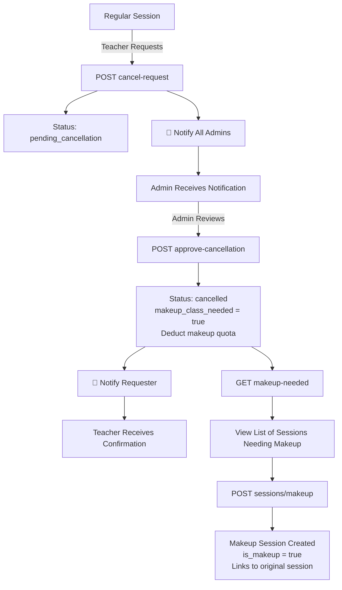

# Session Cancellation & Makeup Class Management

## 📋 Overview

ระบบจัดการการยกเลิกคลาสและ makeup class สำหรับนักเรียน โดยมีการควบคุมโควต้าการชดเชยคลาส (makeup quota) และระบบ approval จากแอดมิน

## 🔄 Workflow

### 1. Request Cancellation (Student/Teacher)
```
Student/Teacher → Request Cancellation (⏰ Must be >24h before class)
                                       → Validate deadline policy
                                       → Status: pending_cancellation
                                       → 🔔 Notification sent to all Admins
                                       → 📝 Audit log created
```

### 2. Admin Approval (Single or Bulk)
```
Admin Reviews → Approves (Single or Bulk) → Deducts makeup quota → Status: cancelled
                                                                  → 🔔 Notification sent to Requester
                                                                  → 📝 Audit log created
```

### 3. Create Makeup Class
```
Admin → Views makeup-needed list → Creates makeup session
```

## 📊 Database Changes

### Students Table
| Field | Type | Default | Description |
|-------|------|---------|-------------|
| `make_up_remaining` | int | 2 | จำนวนสิทธิ์ชดเชยคลาสที่เหลือ |

### Schedule_Sessions Table
| Field | Type | Default | Description |
|-------|------|---------|-------------|
| `status` | enum | - | เพิ่ม `pending_cancellation` |
| `cancellation_requested_at` | timestamp | null | เวลาที่ขอยกเลิก |
| `cancellation_requested_by_id` | uint | null | ผู้ขอยกเลิก (user_id) |
| `cancellation_approved_at` | timestamp | null | เวลาที่แอดมิน approve |
| `cancellation_approved_by_id` | uint | null | แอดมินที่ approve (user_id) |
| `makeup_class_needed` | boolean | false | ต้องสร้าง makeup class หรือไม่ |

## 🔌 API Endpoints

### 1. Get Session Details (Enhanced)
**GET** `/api/schedules/sessions/:id`

**Response Changes:**
```json
{
  "session": {
    "id": 123,
    "remaining_hours": 18.0,  // ✅ NEW: ชั่วโมงคงเหลือ (exclude cancelled sessions)
    ...
  }
}
```

**Calculation:**
```
remaining_hours = total_hours - (completed_sessions_count * hours_per_session)
```
- Excludes sessions with status: `cancelled`, `pending_cancellation`
- Counts only: `completed`, `confirmed`, `no-show`

---

### 2. Update Makeup Quota (Admin Only)
**PATCH** `/api/students/:id/makeup-quota`

**Headers:**
```
Authorization: Bearer <admin_token>
```

**Request Body:**
```json
{
  "make_up_remaining": 5,
  "reason": "Student paid for additional makeup classes"
}
```

**Response:**
```json
{
  "success": true,
  "message": "Makeup quota updated successfully",
  "student_id": 42,
  "old_quota": 2,
  "new_quota": 5,
  "make_up_remaining": 5
}
```

**Validation:**
- `make_up_remaining`: 0-10
- Requires: `owner` or `admin` role

---

### 3. Request Session Cancellation
**POST** `/api/schedules/sessions/:id/cancel-request`

**Headers:**
```
Authorization: Bearer <token>
```

**Request Body:**
```json
{
  "reason": "Student is sick and cannot attend class"
}
```

**Response:**
```json
{
  "success": true,
  "message": "Cancellation request submitted. Waiting for admin approval.",
  "session": {
    "id": 123,
    "status": "pending_cancellation",
    "cancellation_requested_at": "2025-10-15T14:30:00Z",
    "cancellation_requested_by": "john_teacher",
    "reason": "Student is sick and cannot attend class"
  }
}
```

**Business Rules:**
- ⏰ **24-Hour Deadline Policy**: Cannot cancel within 24 hours of class time
- Cannot cancel if status is: `cancelled`, `pending_cancellation`, `completed`
- Reason is required
- Accessible by: teacher or above

**📝 Audit Logging:**
- Every cancellation request is logged with: User, Session ID, Schedule ID, Date, Reason, IP address
- Format: `[AUDIT] Cancellation Requested | User: john_teacher (ID: 15) | Session: 123 | ...`

**🔔 Notifications:**
- **Sent to**: All admins (role: `admin`, `owner`)
- **Type**: `warning`
- **Channel**: `normal` (notification bell)
- **Content**: Session date, requester name, reason
- **Action**: `review_cancellation` - Links to session details

**Error Responses:**
```json
// Already cancelled
{
  "error": "Session is already cancelled"
}

// Already pending
{
  "error": "Cancellation request already pending"
}

// Completed session
{
  "error": "Cannot cancel completed session"
}

// Within 24 hours of class
{
  "error": "Cannot cancel within 24 hours of class",
  "hours_remaining": "18.5",
  "policy": "Cancellation must be requested at least 24 hours before class time"
}
```

---

### 4. Approve Session Cancellation (Admin Only)
**POST** `/api/schedules/sessions/:id/approve-cancellation`

**Headers:**
```
Authorization: Bearer <admin_token>
```

**Response:**
```json
{
  "success": true,
  "message": "Cancellation approved successfully",
  "session": {
    "id": 123,
    "status": "cancelled",
    "makeup_class_needed": true,
    "cancellation_approved_at": "2025-10-15T15:00:00Z",
    "cancellation_approved_by": "admin_user"
  },
  "affected_students": [
    {
      "student_id": 10,
      "first_name": "สมชาย",
      "last_name": "ใจดี",
      "old_makeup_quota": 2,
      "new_makeup_quota": 1
    },
    {
      "student_id": 11,
      "first_name": "สมหญิง",
      "last_name": "รักเรียน",
      "old_makeup_quota": 0,
      "new_makeup_quota": 0,
      "warning": "Student has no remaining makeup quota"
    }
  ],
  "next_step": "Create a makeup class for this cancelled session"
}
```

**Business Logic:**
1. Check session status == `pending_cancellation`
2. Begin database transaction
3. Update session:
   - `status` → `cancelled`
   - `cancellation_approved_at` → now
   - `cancellation_approved_by_id` → admin user ID
   - `makeup_class_needed` → true
4. For each student in group:
   - If `make_up_remaining > 0`: Deduct 1
   - If `make_up_remaining == 0`: Log warning
5. Commit transaction
6. **Send notification to requester**

**🔔 Notifications:**
- **Sent to**: User who requested the cancellation
- **Type**: `success`
- **Channel**: `normal` (notification bell)
- **Content**: Session date, admin who approved, makeup class info
- **Action**: `view_session` - Links to session details

**Access Control:**
- Requires: `owner` or `admin` role

**Error Responses:**
```json
// Not pending
{
  "error": "Session is not pending cancellation"
}

// Database error
{
  "error": "Failed to update makeup quota for student ID 42"
}
```

---

### 5. List Sessions Needing Makeup
**GET** `/api/schedules/sessions/makeup-needed`

**Headers:**
```
Authorization: Bearer <token>
```

**Response:**
```json
{
  "success": true,
  "sessions_needing_makeup": [
    {
      "session_id": 123,
      "schedule_id": 45,
      "schedule_name": "English Conversation - Group A",
      "session_date": "2025-10-14",
      "start_time": "14:00",
      "end_time": "16:00",
      "cancelling_reason": "Student is sick",
      "cancelled_at": "2025-10-15T15:00:00Z",
      "group": {
        "id": 12,
        "group_name": "Group A - Intermediate",
        "level": "B1"
      },
      "course": {
        "id": 3,
        "course_name": "English Conversation"
      }
    }
  ],
  "total": 1
}
```

**Query Criteria:**
- `status = 'cancelled'`
- `makeup_class_needed = true`
- Ordered by: `session_date DESC`

**Access Control:**
- Requires: `teacher` or above

---

### 6. Get Cancellation Status for Schedule (Admin Only)
**GET** `/api/schedules/:id/cancellations/status`

**Headers:**
```
Authorization: Bearer <admin_token>
```

**Description:**
ดูสถานะของการยกเลิกคลาสสำหรับ schedule เดียว รวมถึงสถิติและรายละเอียดของคำขอที่รอดำเนินการ

**Response:**
```json
{
  "success": true,
  "schedule_id": 45,
  "schedule_name": "English Conversation - Group A",
  "group_name": "Group A - Intermediate",
  "statistics": {
    "total_sessions": 20,
    "completed_sessions": 10,
    "pending_cancellation": 2,
    "approved_cancellation": 3,
    "cancellation_rate": 15.0
  },
  "pending_requests": {
    "count": 2,
    "details": [
      {
        "session_id": 125,
        "session_number": 12,
        "session_date": "2025-10-20",
        "reason": "Student has emergency",
        "requested_at": "2025-10-18T10:30:00Z",
        "requested_by": "john_teacher",
        "requested_by_id": 15,
        "days_pending": 1.5
      },
      {
        "session_id": 126,
        "session_number": 13,
        "session_date": "2025-10-22",
        "reason": "Teacher is sick",
        "requested_at": "2025-10-17T14:00:00Z",
        "requested_by": "mary_teacher",
        "requested_by_id": 18,
        "days_pending": 2.3
      }
    ]
  },
  "recently_cancelled": {
    "count": 3,
    "details": [
      {
        "session_id": 123,
        "session_number": 10,
        "session_date": "2025-10-14",
        "reason": "Student is sick",
        "approved_at": "2025-10-15T15:00:00Z",
        "approved_by": "admin_user",
        "approved_by_id": 1,
        "makeup_needed": true
      }
    ]
  }
}
```

**Use Cases:**
- Admin ต้องการดูภาพรวมของการยกเลิกคลาสใน schedule เดียว
- ตรวจสอบว่ามีคำขอรอ approve กี่รายการ
- ดูประวัติการยกเลิกล่าสุด
- คำนวณ cancellation rate

**Access Control:**
- Requires: `owner` or `admin` role

---

### 7. Get All Cancellations Status (Admin Only)
**GET** `/api/schedules/cancellations/all`

**Headers:**
```
Authorization: Bearer <admin_token>
```

**Query Parameters:**
- `status` (optional): Filter by status
  - `all` (default) - ทั้งหมด
  - `pending` - รอ approve
  - `cancelled` - approve แล้ว
- `limit` (optional): จำนวนรายการต่อหน้า (default: 20)
- `offset` (optional): เริ่มต้นจากรายการที่ (default: 0)

**Description:**
ดูสถานะของการยกเลิกคลาสทั้งหมดในระบบ รองรับการ filter และ pagination

**Example Requests:**

```bash
# ดูคำขอทั้งหมด (pending + cancelled)
GET /api/schedules/cancellations/all

# ดูเฉพาะคำขอที่รอ approve
GET /api/schedules/cancellations/all?status=pending

# ดูเฉพาะที่ approve แล้ว
GET /api/schedules/cancellations/all?status=cancelled

# Pagination
GET /api/schedules/cancellations/all?limit=10&offset=20
```

**Response:**
```json
{
  "success": true,
  "statistics": {
    "total_pending": 5,
    "total_cancelled": 12,
    "total": 17
  },
  "requests": [
    {
      "session_id": 125,
      "schedule_id": 45,
      "schedule_name": "English Conversation - Group A",
      "session_number": 12,
      "session_date": "2025-10-20",
      "status": "pending_cancellation",
      "reason": "Student has emergency",
      "requested_at": "2025-10-18T10:30:00Z",
      "requested_by": "john_teacher",
      "requested_by_id": 15,
      "days_pending": 1.5,
      "makeup_needed": false,
      "group": {
        "id": 12,
        "group_name": "Group A - Intermediate",
        "level": "B1"
      },
      "course": {
        "id": 3,
        "name": "English Conversation"
      }
    },
    {
      "session_id": 123,
      "schedule_id": 45,
      "schedule_name": "English Conversation - Group A",
      "session_number": 10,
      "session_date": "2025-10-14",
      "status": "cancelled",
      "reason": "Student is sick",
      "requested_at": "2025-10-13T10:00:00Z",
      "requested_by": "john_teacher",
      "requested_by_id": 15,
      "approved_at": "2025-10-15T15:00:00Z",
      "approved_by": "admin_user",
      "approved_by_id": 1,
      "makeup_needed": true,
      "group": {
        "id": 12,
        "group_name": "Group A - Intermediate",
        "level": "B1"
      },
      "course": {
        "id": 3,
        "name": "English Conversation"
      }
    }
  ],
  "pagination": {
    "offset": 0,
    "limit": 20,
    "total": 17
  },
  "filter": {
    "status": "all"
  }
}
```

**Use Cases:**
- **Dashboard แอดมิน**: แสดงภาพรวมของคำขอยกเลิกทั้งหมด
- **Priority Management**: เรียงลำดับตาม `days_pending` เพื่อดูคำขอที่รอนาน
- **Reporting**: สร้างรายงานการยกเลิกคลาสรายเดือน/รายปี
- **Monitoring**: ตรวจสอบว่ามีคำขอที่ค้างนานเกินไปหรือไม่

**Access Control:**
- Requires: `owner` or `admin` role

**Error Responses:**
```json
// Invalid status parameter
{
  "error": "Invalid status. Must be: all, pending, or cancelled"
}
```

---

### 8. Bulk Approve Cancellations (Admin Only)
**POST** `/api/schedules/cancellations/bulk-approve`

**Headers:**
```
Authorization: Bearer <admin_token>
```

**Description:**
อนุมัติคำขอยกเลิกหลาย sessions พร้อมกัน สำหรับประหยัดเวลาเมื่อมีคำขอรออนุมัติจำนวนมาก

**Request Body:**
```json
{
  "session_ids": [123, 125, 126, 128]
}
```

**Response:**
```json
{
  "success": true,
  "message": "Processed 4 cancellation requests",
  "summary": {
    "total_requested": 4,
    "successful": 3,
    "failed": 1
  },
  "successful_approvals": [
    {
      "session_id": 123,
      "session_date": "2025-10-20",
      "affected_students": 5,
      "requester_notified": true,
      "requester_id": 15,
      "makeup_class_needed": true
    },
    {
      "session_id": 125,
      "session_date": "2025-10-22",
      "affected_students": 5,
      "requester_notified": true,
      "requester_id": 18,
      "makeup_class_needed": true
    },
    {
      "session_id": 126,
      "session_date": "2025-10-24",
      "affected_students": 4,
      "requester_notified": false,
      "requester_id": null,
      "makeup_class_needed": true
    }
  ],
  "failed_approvals": [
    {
      "session_id": 128,
      "error": "Session status is 'completed', not pending cancellation"
    }
  ],
  "next_step": "Create makeup classes for the cancelled sessions"
}
```

**Validation:**
- Maximum 50 sessions per bulk operation
- Each session must be in `pending_cancellation` status
- Individual failures don't rollback the entire transaction

**📝 Audit Logging:**
- Logs bulk approval with summary: total requested, successful, failed
- Format: `[AUDIT] Bulk Cancellation Approval | Admin: admin_user (ID: 1) | Total: 4 | Success: 3 | Failed: 1`

**🔔 Notifications:**
- Each requester receives individual approval notification
- Notifications sent after transaction commits

**Access Control:**
- Requires: `owner` or `admin` role

---

### 9. Get Dashboard Statistics (Admin Only)
**GET** `/api/schedules/cancellations/dashboard-stats`

**Headers:**
```
Authorization: Bearer <admin_token>
```

**Query Parameters:**
- `period` (optional): Number of days to look back (default: 30, max: 365)

**Description:**
ดึงสถิติรวมสำหรับ admin dashboard รวมถึง trends, top reasons, และ teacher statistics

**Example Request:**
```bash
GET /api/schedules/cancellations/dashboard-stats?period=30
```

**Response:**
```json
{
  "success": true,
  "period": {
    "days": 30,
    "start_date": "2025-09-15",
    "end_date": "2025-10-15"
  },
  "overall_statistics": {
    "total_pending": 5,
    "total_cancelled": 24,
    "total_completed": 180,
    "total_scheduled": 45,
    "cancellation_rate": 11.76,
    "pending_needs_action": 5
  },
  "weekly_trend": [
    {"week": "2025-W40", "count": 3},
    {"week": "2025-W41", "count": 5},
    {"week": "2025-W42", "count": 8}
  ],
  "top_cancellation_reasons": [
    {"reason": "Student is sick", "count": 12},
    {"reason": "Teacher emergency", "count": 6},
    {"reason": "Holiday conflict", "count": 4},
    {"reason": "Student travel", "count": 2}
  ],
  "teachers_with_most_cancellations": [
    {"user_id": 15, "username": "john_teacher", "count": 8},
    {"user_id": 18, "username": "mary_teacher", "count": 5},
    {"user_id": 22, "username": "david_teacher", "count": 3}
  ],
  "schedules_with_highest_cancellation_rate": [
    {
      "schedule_id": 45,
      "schedule_name": "English Conversation - Group A",
      "total_sessions": 20,
      "cancelled_count": 5,
      "cancellation_rate": 25.0
    },
    {
      "schedule_id": 52,
      "schedule_name": "IELTS Preparation",
      "total_sessions": 30,
      "cancelled_count": 4,
      "cancellation_rate": 13.33
    }
  ],
  "urgent_pending_requests": {
    "count": 2,
    "details": [
      {
        "session_id": 125,
        "schedule_id": 45,
        "schedule_name": "English Conversation - Group A",
        "session_date": "2025-10-20",
        "requested_by": "john_teacher",
        "requested_at": "2025-10-12T10:30:00Z",
        "days_pending": 3.5,
        "reason": "Student emergency"
      }
    ]
  },
  "approval_metrics": {
    "average_approval_time_hours": 18.5,
    "urgent_count_over_3_days": 2
  },
  "makeup_class_status": {
    "sessions_needing_makeup": 24,
    "makeup_sessions_created": 20,
    "pending_makeup_creation": 4
  }
}
```

**Use Cases:**
- **Executive Dashboard**: ภาพรวมของระบบ cancellation
- **Trend Analysis**: ดู pattern การยกเลิกรายสัปดาห์
- **Problem Identification**: หา schedule หรือครูที่มีปัญหา
- **Performance Metrics**: วัด average approval time
- **Action Items**: ดูคำขอ urgent ที่รอเกิน 3 วัน

**Access Control:**
- Requires: `owner` or `admin` role

---

## 📊 Admin Dashboard & Monitoring

### Overview

แอดมินสามารถตรวจสอบและจัดการคำขอยกเลิกคลาสได้ผ่าน 2 มุมมอง:

#### 1. **Schedule-Level View** (ดูรายละเอียดของ schedule เดียว)
```
GET /api/schedules/:id/cancellations/status
```
- สถิติการยกเลิกของ schedule
- คำขอที่รออนุมัติ
- ประวัติการยกเลิกล่าสุด
- Cancellation rate

**Use Case:** Admin ต้องการดูว่า schedule นี้มีปัญหาการยกเลิกบ่อยหรือไม่

#### 2. **System-Level View** (ดูภาพรวมทั้งระบบ)
```
GET /api/schedules/cancellations/all
```
- คำขอทั้งหมดในระบบ
- สถิติรวม (pending, cancelled)
- รองรับ filter และ pagination
- เรียงลำดับตามวันที่ขอ

**Use Case:** Dashboard แอดมินแสดงจำนวนคำขอที่รออนุมัติทั้งหมด

### Typical Admin Workflow

**Morning Routine:**
```
1. เปิด Dashboard
2. GET /cancellations/all?status=pending
3. เห็นมี 5 คำขอรออนุมัติ
4. เรียงตาม days_pending (urgent first)
5. Review แต่ละรายการ:
   - อ่านเหตุผล
   - ตรวจสอบ schedule pattern
   - ดู makeup quota ของนักเรียน
6. POST /sessions/:id/approve-cancellation
7. สร้าง makeup sessions
```

**Weekly Review:**
```
1. GET /cancellations/all?status=cancelled&limit=100
2. วิเคราะห์ pattern:
   - Schedule ไหนยกเลิกบ่อย?
   - ครูคนไหนขอยกเลิกบ่อย?
   - เหตุผลหลักคืออะไร?
3. สร้าง action plan แก้ไขปัญหา
```

### Recommended Actions for Admins

🟢 **Good Practice:**
- Review คำขอภายใน 24 ชั่วโมง
- ตรวจสอบ pattern ของ schedule ที่มี cancellation rate สูง
- สื่อสารกับครู/นักเรียนถ้ามีปัญหาซ้ำ
- สร้าง makeup session ทันทีหลัง approve
- ติดตาม makeup quota ของนักเรียน

🔴 **Watch Out For:**
- คำขอที่รอเกิน 3 วัน (urgent)
- Schedule ที่มี cancellation rate > 20%
- นักเรียนที่ makeup quota เหลือ 0
- ครูที่ขอยกเลิกบ่อยโดยไม่มีเหตุผลสมควร

---

## � Notification System

### Automatic Notifications

The cancellation system sends automatic notifications to keep all parties informed:

#### 1. **Cancellation Request Notification**
**Trigger:** When teacher/user requests session cancellation  
**Recipients:** All admins (role: `admin`, `owner`)  
**Type:** `warning`  
**Contains:**
- Session date and time
- Requester name
- Cancellation reason
- Action button to review request

**Example:**
```
Title (EN): Session Cancellation Request
Title (TH): คำขอยกเลิกคาบเรียน

Message (EN): john_teacher requested to cancel session on Oct 14, 2025. Reason: Student is sick
Message (TH): john_teacher ขอยกเลิกคาบเรียนวันที่ Oct 14, 2025 เหตุผล: Student is sick
```

#### 2. **Approval Confirmation Notification**
**Trigger:** When admin approves cancellation request  
**Recipients:** User who requested the cancellation  
**Type:** `success`  
**Contains:**
- Session date
- Admin who approved
- Confirmation that makeup class will be created
- Action button to view session details

**Example:**
```
Title (EN): Cancellation Request Approved
Title (TH): อนุมัติคำขอยกเลิกคาบเรียนแล้ว

Message (EN): Your cancellation request for session on Oct 14, 2025 has been approved by admin_user. A makeup class will be created.
Message (TH): คำขอยกเลิกคาบเรียนวันที่ Oct 14, 2025 ของคุณได้รับการอนุมัติโดย admin_user จะมีการสร้างคาบชดเชย
```

### Notification Channels

All notifications are sent through:
- **Normal channel**: Appears in notification bell icon
- **WebSocket**: Real-time delivery to connected users
- **Database**: Persistent storage for notification history

### Notification Data Structure

```json
{
  "action": "review_cancellation",
  "session_id": 123,
  "schedule_id": 45,
  "group_name": "Group A - Intermediate",
  "requested_by": "john_teacher",
  "requested_at": "2025-10-15T14:30:00Z",
  "reason": "Student is sick",
  "action_label": "Review Request"
}
```

### User Experience Flow

```
Teacher Requests Cancellation
         ↓
    [Notification Created]
         ↓
    Admin Bell Icon 🔔 (red badge)
         ↓
    Admin Clicks Notification
         ↓
    Redirects to Session Details
         ↓
    Admin Reviews & Approves
         ↓
    [Approval Notification Created]
         ↓
    Teacher Bell Icon 🔔
         ↓
    Teacher Sees Confirmation
```

---

## �💡 Use Cases

### Case 1: Student ป่วยไม่สามารถมาเรียนได้

**Step 1: Request Cancellation**
```bash
POST /api/schedules/sessions/8837/cancel-request
{
  "reason": "นักเรียนป่วย ไม่สามารถมาเรียนได้"
}
```
- 🔔 **Notification sent to all admins**: "คำขอยกเลิกคาบเรียน"

**Step 2: Admin Review & Approve**
- Admin receives notification
- Reviews cancellation request
```bash
POST /api/schedules/sessions/8837/approve-cancellation
```
- System deducts makeup quota: 2 → 1
- Session status: `cancelled`
- Makeup flag: `true`
- 🔔 **Notification sent to requester**: "อนุมัติคำขอยกเลิกคาบเรียนแล้ว"

**Step 3: Check Makeup List**
```bash
GET /api/schedules/sessions/makeup-needed
```

**Step 4: Create Makeup Session**
```bash
POST /api/schedules/sessions/makeup
{
  "makeup_for_session_id": 8837,
  "session_date": "2025-10-22",
  "start_time": "14:00:00"
}
```

---

### Case 2: นักเรียนใช้โควต้า makeup หมดแล้ว

**Scenario:**
- Student has `make_up_remaining = 0`
- Requests cancellation

**Admin Options:**

**Option A: Increase Quota First**
```bash
PATCH /api/students/42/makeup-quota
{
  "make_up_remaining": 1,
  "reason": "Special case - medical emergency"
}
```

Then approve cancellation:
```bash
POST /api/schedules/sessions/8837/approve-cancellation
```

**Option B: Deny Cancellation**
- Contact student
- Explain no makeup quota remaining
- Student must attend or lose the class

---

### Case 3: Admin เพิ่มโควต้า makeup ให้นักเรียน

**Scenario:**
- Student pays for additional makeup classes
- Or special promotion

```bash
PATCH /api/students/42/makeup-quota
{
  "make_up_remaining": 5,
  "reason": "Student purchased 3 additional makeup classes"
}
```

**Response:**
```json
{
  "success": true,
  "old_quota": 2,
  "new_quota": 5
}
```

---

### Case 4: Admin ตรวจสอบสถานะการยกเลิกของ Schedule

**Scenario:**
- Admin ต้องการดูว่า schedule มีการยกเลิกเท่าไหร่
- มีคำขอรออนุมัติกี่รายการ

**Step 1: ดูสถานะของ Schedule เดียว**
```bash
GET /api/schedules/45/cancellations/status
```

**Response:**
```json
{
  "statistics": {
    "total_sessions": 20,
    "pending_cancellation": 2,
    "approved_cancellation": 3,
    "cancellation_rate": 15.0
  },
  "pending_requests": {
    "count": 2,
    "details": [...]
  }
}
```

**Admin Actions:**
- เห็นว่ามี 2 คำขอรออนุมัติ
- Cancellation rate อยู่ที่ 15%
- คลิกดูรายละเอียดแต่ละคำขอ
- Approve หรือ deny ตามเหตุผล

---

### Case 5: Admin Dashboard - ดูคำขอทั้งหมดในระบบ

**Scenario:**
- Admin ต้องการดูภาพรวมของการยกเลิกทั้งหมด
- ต้องการจัดลำดับความสำคัญ (priority)

**Step 1: ดูคำขอที่รออนุมัติทั้งหมด**
```bash
GET /api/schedules/cancellations/all?status=pending
```

**Response:**
```json
{
  "statistics": {
    "total_pending": 5,
    "total_cancelled": 12
  },
  "requests": [
    {
      "session_id": 125,
      "days_pending": 3.5,
      "reason": "Student has emergency",
      "requested_by": "john_teacher",
      ...
    },
    {
      "session_id": 126,
      "days_pending": 1.2,
      "reason": "Teacher is sick",
      ...
    }
  ]
}
```

**Admin Actions:**
- เรียงตาม `days_pending` (รายการที่รอนานที่สุดก่อน)
- Review แต่ละรายการ
- Approve/Deny based on reason และ policy
- ดูว่า schedule ไหนมีการยกเลิกบ่อย (pattern)

**Step 2: ดูประวัติการยกเลิกที่ผ่านมา**
```bash
GET /api/schedules/cancellations/all?status=cancelled&limit=50
```

**Use for:**
- สร้างรายงานรายเดือน
- วิเคราะห์ pattern การยกเลิก
- ตรวจสอบว่ามี makeup class ครบหรือยัง

---

## � Creating Sessions

### วิธีสร้าง Session ปกติ (Regular Schedule)

#### Method 1: Create Complete Schedule (สร้าง Schedule พร้อม Sessions อัตโนมัติ)

**POST** `/api/schedules`

**Request Body:**
```json
{
  "schedule_name": "English Conversation - Group A",
  "schedule_type": "class",
  "group_id": 12,
  "start_date": "2025-10-20",
  "total_hours": 40,
  "hours_per_session": 2,
  "session_per_week": 2,
  "recurring_pattern": "weekly",
  "session_times": [
    {
      "weekday": 1,
      "start_time": "14:00:00"
    },
    {
      "weekday": 3,
      "start_time": "14:00:00"
    }
  ],
  "default_teacher_id": 5,
  "default_room_id": 3
}
```

**ผลลัพธ์:**
- System สร้าง sessions อัตโนมัติตาม pattern
- จำนวน sessions = `total_hours / hours_per_session` = 40 / 2 = 20 sessions
- กระจายตาม `session_per_week` = 2 sessions/สัปดาห์
- Sessions จะถูกสร้างในวัน Monday (weekday=1) และ Wednesday (weekday=3)
- เวลาเริ่ม 14:00:00, ระยะเวลา 2 ชั่วโมง (14:00-16:00)

**Response:**
```json
{
  "success": true,
  "schedule": {
    "id": 45,
    "schedule_name": "English Conversation - Group A",
    "total_sessions": 20,
    "created": true
  },
  "sessions_created": 20
}
```

---

#### Method 2: Add Session to Existing Schedule

**POST** `/api/schedules/:schedule_id/sessions`

**Request Body:**
```json
{
  "session_date": "2025-10-25",
  "start_time": "14:00:00",
  "end_time": "16:00:00",
  "assigned_teacher_id": 5,
  "room_id": 3,
  "notes": "Extra session for exam preparation"
}
```

**Use Case:**
- เพิ่ม session พิเศษให้กับ schedule ที่มีอยู่
- กรณีต้องการ session เพิ่มเติมนอกเหนือจาก pattern ปกติ

**Response:**
```json
{
  "success": true,
  "session": {
    "id": 124,
    "session_number": 21,
    "session_date": "2025-10-25",
    "status": "scheduled"
  }
}
```

---

### วิธีสร้าง Makeup Session (ชดเชยคลาสที่ยกเลิก)

**POST** `/api/schedules/sessions/makeup`

**Request Body:**
```json
{
  "makeup_for_session_id": 123,
  "session_date": "2025-10-30",
  "start_time": "15:00:00",
  "end_time": "17:00:00",
  "assigned_teacher_id": 5,
  "room_id": 3,
  "notes": "Makeup class for cancelled session on 2025-10-14"
}
```

**Required Fields:**
- `makeup_for_session_id` - ID ของ session ที่ถูกยกเลิก (จาก makeup-needed list)
- `session_date` - วันที่ต้องการจัด makeup class
- `start_time` - เวลาเริ่ม
- `end_time` - เวลาสิ้นสุด (optional, จะคำนวณจาก hours_per_session)

**Optional Fields:**
- `assigned_teacher_id` - ครูผู้สอน (ถ้าไม่ระบุจะใช้ default teacher)
- `room_id` - ห้องเรียน (ถ้าไม่ระบุจะใช้ default room)
- `notes` - หมายเหตุ

**Business Logic:**
1. ระบบตรวจสอบว่า session ต้นฉบับถูกยกเลิกจริง
2. ตรวจสอบว่ายังไม่มี makeup session สำหรับ session นี้แล้ว
3. สร้าง session ใหม่พร้อม flag:
   - `is_makeup = true`
   - `makeup_for_session_id = 123`
   - `status = scheduled`
4. คัดลอกข้อมูล group, course จาก session ต้นฉบับ
5. ตั้งค่า `makeup_class_needed = false` ใน session ต้นฉบับ

**Response:**
```json
{
  "success": true,
  "makeup_session": {
    "id": 125,
    "session_date": "2025-10-30",
    "start_time": "15:00",
    "end_time": "17:00",
    "is_makeup": true,
    "makeup_for_session_id": 123,
    "status": "scheduled",
    "schedule_id": 45,
    "group": {
      "id": 12,
      "group_name": "Group A - Intermediate"
    }
  },
  "original_session": {
    "id": 123,
    "status": "cancelled",
    "makeup_class_needed": false,
    "makeup_session_created": true
  }
}
```

**Error Cases:**
```json
// Original session not cancelled
{
  "error": "Original session must be cancelled to create makeup"
}

// Makeup already exists
{
  "error": "Makeup session already created for this cancelled session"
}

// Session not found
{
  "error": "Original session not found"
}

// Room conflict
{
  "error": "Room is not available at the specified time"
}

// Teacher conflict
{
  "error": "Teacher has another session at the specified time"
}
```

---

### 🔄 Complete Workflow: Cancellation → Makeup Creation



**Timeline Example:**
```
Oct 14, 2025 14:00 - Regular session scheduled
Oct 13, 2025 10:00 - Teacher requests cancellation (student sick)
Oct 13, 2025 15:00 - Admin approves cancellation
                    - Student makeup quota: 2 → 1
                    - Session status: cancelled
                    - makeup_class_needed: true
Oct 13, 2025 15:30 - Admin checks makeup-needed list
Oct 13, 2025 16:00 - Admin creates makeup session for Oct 30, 2025
                    - New session created: ID 125
                    - is_makeup: true
                    - makeup_for_session_id: 123
Oct 30, 2025 15:00 - Makeup class takes place
```

---

### 📝 Best Practices for Creating Sessions

#### Regular Sessions
✅ **Do:**
- ใช้ `POST /schedules` สำหรับสร้างตารางเรียนทั้งเทอม
- กำหนด `session_times` ให้ชัดเจน (วัน + เวลา)
- ตรวจสอบ room/teacher conflicts ด้วย preview endpoint ก่อน
- ระบุ `default_teacher_id` และ `default_room_id`

❌ **Don't:**
- อย่าสร้าง sessions ทีละ session ด้วยตัวเอง (ใช้ system generate)
- อย่าลืมตรวจสอบ branch operating hours
- อย่าสร้าง session ซ้อนทับกัน

#### Makeup Sessions
✅ **Do:**
- ตรวจสอบ makeup-needed list ก่อนสร้าง
- เลือกเวลาที่นักเรียนทุกคนสะดวก
- ใช้ครูคนเดิม (ถ้าเป็นไปได้)
- ใส่ notes อธิบายว่าชดเชยจาก session ไหน

❌ **Don't:**
- อย่าสร้าง makeup session ก่อน admin approve cancellation
- อย่าลืม link กับ original session (`makeup_for_session_id`)
- อย่าสร้าง makeup หลายครั้งสำหรับ session เดียวกัน

---

### 🎯 Quick Reference

| Task | Endpoint | Method | Auth |
|------|----------|--------|------|
| สร้าง schedule ใหม่ (พร้อม sessions) | `/api/schedules` | POST | Admin |
| เพิ่ม session ใน schedule ที่มีอยู่ | `/api/schedules/:id/sessions` | POST | Admin |
| Preview sessions ก่อนสร้าง | `/api/schedules/preview` | POST | Admin |
| ตรวจสอบ room conflicts | `/api/schedules/rooms/check-conflicts` | POST | Admin |
| สร้าง makeup session | `/api/schedules/sessions/makeup` | POST | Admin |
| ดู sessions ที่ต้อง makeup | `/api/schedules/sessions/makeup-needed` | GET | Teacher+ |
| ดูรายละเอียด session | `/api/schedules/sessions/:id` | GET | All |
| อัพเดท session | `/api/schedules/sessions/:id` | PATCH | Admin |
| **ขอยกเลิก session** | `/api/schedules/sessions/:id/cancel-request` | POST | Teacher+ |
| **Approve การยกเลิก** | `/api/schedules/sessions/:id/approve-cancellation` | POST | Admin |
| **Bulk approve การยกเลิก** | `/api/schedules/cancellations/bulk-approve` | POST | Admin |
| **ดูสถานะยกเลิกของ schedule** | `/api/schedules/:id/cancellations/status` | GET | Admin |
| **ดูคำขอยกเลิกทั้งหมด** | `/api/schedules/cancellations/all` | GET | Admin |
| **ดู Dashboard Statistics** | `/api/schedules/cancellations/dashboard-stats` | GET | Admin |

---

## �📐 Business Rules

### Makeup Quota
- **Default**: 2 makeup classes per student
- **Range**: 0-10
- **Adjustable**: Admin can increase/decrease
- **Deduction**: -1 when cancellation approved

### Cancellation Eligibility
✅ **Can Cancel:**
- ⏰ **Must be >24 hours before class time** (Deadline Policy)
- Status: `scheduled`, `confirmed`, `pending`
- Reason provided
- By: Teacher or above

❌ **Cannot Cancel:**
- Status: `cancelled`, `pending_cancellation`, `completed`
- No reason provided

### Approval Process
1. Student/Teacher submits request → `pending_cancellation`
2. Admin reviews reason
3. Admin approves:
   - Deduct makeup quota (if available)
   - Set status → `cancelled`
   - Mark `makeup_class_needed = true`
4. Admin creates makeup session

### Remaining Hours Calculation
```
Total Hours: 40
Hours Per Session: 2

Sessions:
- Completed: 5 sessions
- Scheduled: 10 sessions
- Cancelled: 2 sessions (EXCLUDED)
- Pending Cancellation: 1 session (EXCLUDED)

Used Hours = 5 completed × 2 hours = 10 hours
Remaining Hours = 40 - 10 = 30 hours
```

---

## 🔐 Permission Matrix

| Endpoint | Student | Teacher | Admin | Owner |
|----------|---------|---------|-------|-------|
| GET session details | ✅ | ✅ | ✅ | ✅ |
| Update makeup quota | ❌ | ❌ | ✅ | ✅ |
| Request cancellation | ❌ | ✅ | ✅ | ✅ |
| Approve cancellation | ❌ | ❌ | ✅ | ✅ |
| **Bulk approve cancellations** | ❌ | ❌ | ✅ | ✅ |
| List makeup needed | ❌ | ✅ | ✅ | ✅ |
| Get schedule cancellation status | ❌ | ❌ | ✅ | ✅ |
| Get all cancellations status | ❌ | ❌ | ✅ | ✅ |
| **Get dashboard statistics** | ❌ | ❌ | ✅ | ✅ |

---

## 🚨 Error Handling

### Common Errors

**400 Bad Request**
```json
{
  "error": "Cancellation reason is required"
}
```

**404 Not Found**
```json
{
  "error": "Session not found"
}
```

**403 Forbidden**
```json
{
  "error": "Insufficient permissions"
}
```

**409 Conflict**
```json
{
  "error": "Session is already cancelled"
}
```

**500 Internal Server Error**
```json
{
  "error": "Failed to approve cancellation"
}
```

---

## 📊 Monitoring & Audit

### Logs
All cancellation activities are logged:

```go
log.Printf("Admin updated makeup quota for student ID %d: %d -> %d (reason: %s)", 
    studentID, oldQuota, newQuota, reason)
```

### Audit Fields
- `cancellation_requested_by_id` - Who requested
- `cancellation_requested_at` - When requested
- `cancellation_approved_by_id` - Who approved
- `cancellation_approved_at` - When approved
- `cancelling_reason` - Why cancelled

### Reports
Track:
- Cancellation rate per student
- Makeup quota usage
- Pending cancellation requests
- Makeup classes created

---

## 🔄 Database Migration

### Add to students table:
```sql
ALTER TABLE students 
ADD COLUMN make_up_remaining INT NOT NULL DEFAULT 2;
```

### Add to schedule_sessions table:
```sql
ALTER TABLE schedule_sessions 
ADD COLUMN cancellation_requested_at TIMESTAMP NULL,
ADD COLUMN cancellation_requested_by_id INT UNSIGNED NULL,
ADD COLUMN cancellation_approved_at TIMESTAMP NULL,
ADD COLUMN cancellation_approved_by_id INT UNSIGNED NULL,
ADD COLUMN makeup_class_needed BOOLEAN NOT NULL DEFAULT FALSE;

-- Update status enum
ALTER TABLE schedule_sessions 
MODIFY COLUMN status ENUM('scheduled','confirmed','pending','completed','cancelled','rescheduled','no-show','pending_cancellation') 
DEFAULT 'scheduled';
```

---

## ✅ Testing Checklist

### API Testing
- [ ] Request cancellation with valid reason
- [ ] Request cancellation without reason (should fail)
- [ ] **Request cancellation within 24 hours of class (should fail with deadline error)**
- [ ] Request cancellation of completed session (should fail)
- [ ] Request cancellation when already pending (should fail)
- [ ] Approve pending cancellation
- [ ] Approve non-pending session (should fail)
- [ ] **Bulk approve 3 valid cancellation requests**
- [ ] **Bulk approve with mix of valid and invalid sessions**
- [ ] **Bulk approve with empty array (should fail)**
- [ ] **Bulk approve with >50 sessions (should fail)**
- [ ] List makeup needed sessions
- [ ] Update makeup quota (valid range)
- [ ] Update makeup quota (invalid range - should fail)
- [ ] Check remaining_hours calculation excludes cancelled

### Business Logic Testing
- [ ] Makeup quota deduction on approval
- [ ] Handling students with 0 quota
- [ ] Transaction rollback on error
- [ ] Proper timestamps recorded
- [ ] Audit trail complete

### Notification Testing
- [ ] Admin receives notification when teacher requests cancellation
- [ ] All admins (role: admin, owner) receive notification
- [ ] Notification contains correct session info and reason
- [ ] Requester receives notification when admin approves
- [ ] Approval notification contains correct admin name
- [ ] Notifications appear in notification bell icon
- [ ] Notification count badge updates correctly
- [ ] Action buttons in notifications link correctly

### Status Endpoints Testing
- [ ] Get schedule cancellation status returns correct statistics
- [ ] Pending requests list shows accurate count and details
- [ ] Recently cancelled list shows last 5 approved cancellations
- [ ] Cancellation rate calculation is correct
- [ ] Get all cancellations returns paginated results
- [ ] Filter by status (all, pending, cancelled) works correctly
- [ ] Days pending calculation is accurate
- [ ] Pagination (offset, limit) works correctly
- [ ] Response includes all required fields (group, course, requester, approver)
- [ ] Non-admin cannot access status endpoints (403 error)

### Dashboard Statistics Testing
- [ ] **Get dashboard stats with default period (30 days)**
- [ ] **Get dashboard stats with custom period (7, 90 days)**
- [ ] **Weekly trend data shows correct counts**
- [ ] **Top cancellation reasons ordered by count**
- [ ] **Teachers with most cancellations listed correctly**
- [ ] **Schedules with highest cancellation rate calculated correctly**
- [ ] **Urgent pending requests (>3 days) identified**
- [ ] **Average approval time calculated correctly**
- [ ] **Makeup class status shows accurate counts**
- [ ] **Non-admin cannot access dashboard stats (403 error)**

### Audit Logging Testing
- [ ] **Cancellation request logged with all details**
- [ ] **Approval logged with affected students count**
- [ ] **Bulk approval logged with summary**
- [ ] **All logs include IP address**
- [ ] **Log format is consistent and parseable**

---

**Status**: ✅ Production Ready  
**Created**: October 15, 2025  
**Dependencies**: Students, Schedules, Authentication
